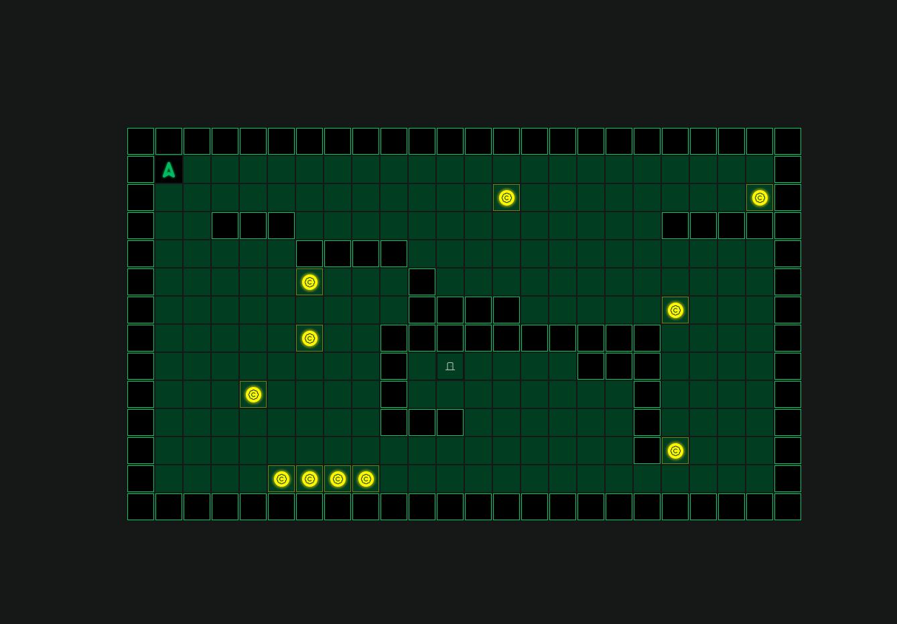

# so_long

<!-- cria uma imagem -->

O projeto **so_long** faz parte do currículo da Escola 42 e consiste na criação de um jogo simples, em 2D, onde o jogador deve coletar itens e encontrar a saída do mapa. O projeto utiliza a biblioteca MinilibX para a renderização gráfica e possui uma série de funcionalidades que permitem a interação com o ambiente do jogo.

## Funcionalidades

- Movimento básico do personagem usando as teclas AWSD.
- Coleta de itens no mapa para permitir a abertura da porta de saída.
- Verificação de colisão com obstáculos.
- Diferentes níveis de dificuldade através de mapas distintos.
- Interface gráfica simples usando MinilibX.

## Estrutura do Projeto

- **src/**: Contém os arquivos fonte do jogo, como a lógica de movimento, renderização e interação com o mapa.
- **maps/**: Diretório contendo os diferentes mapas do jogo.
- **assets/**: Contém imagens e sprites utilizados no jogo.
- **so_long.h**: Arquivo de cabeçalho que contém as definições e protótipos usados no projeto.

## Como Usar

### Compilação

Use o comando `make` para compilar o projeto. Isso irá gerar o executável `so_long`.

```bash
make

## Executando o Jogo

Para iniciar o jogo, execute o seguinte comando

bash
./so_long

O jogador será capaz de controlar o personagem para coletar todos os itens no mapa e depois acessar a saída.

## Controles

    - **WASD**: Movimentam o personagem (cima W, baixo S, esquerda A, direita D).
    - **ESC**: Encerra o jogo.
    
## Requisitos
    - Linguagem: C
    - Bibliotecas: MinilibX, X11 (para ambientes Unix/Linux)

Norminette: O código segue o padrão da Norminette, a convenção de código da Escola 42.
Imagens do Jogo
Menu Inicial

Exemplo de Mapa

## Formato do Mapa

bash
``
111111111111111111111111
1P0000000000000000000001
1000000000000C00000000C1
100111000000000000011111
100000111100000000000001
100000C00010000000000001
1000000000111100000C0001
100000C00111111111100001
10000000010E000011100001
1000C0000100000000100001
100000000111000000100001
1000000000000000001C0001
10000CCCC000000000000001
111111111111111111111111
``

Jogo em Execução

Essas imagens mostram a aparência do jogo, incluindo o menu inicial, o mapa de jogo e a interação do terminal.

Mapas
Os mapas do jogo estão localizados na pasta maps/. Cada mapa é um arquivo .ber que define o layout do nível. Exemplo de mapas disponíveis:

map0.ber: Mapa inicial básico para introdução ao jogo.
map1.ber: Mapa com maior complexidade e desafios.
Considerações
Gerenciamento de Memória: O projeto cuida do gerenciamento de memória para evitar vazamentos durante a execução.
Colisões: O sistema de colisão previne que o jogador atravesse paredes ou se mova para fora do mapa.
Mapas Customizados: Você pode criar seus próprios mapas seguindo o formato dos arquivos .ber existentes.
Futuras Melhorias
Adicionar novos tipos de inimigos e obstáculos.
Implementar um sistema de pontuação baseado no tempo e número de movimentos.
Criar novos níveis com maior complexidade e diferentes tipos de terrenos.
Autor
Max (Xavier Moisés Alberto José) - xmaj2001